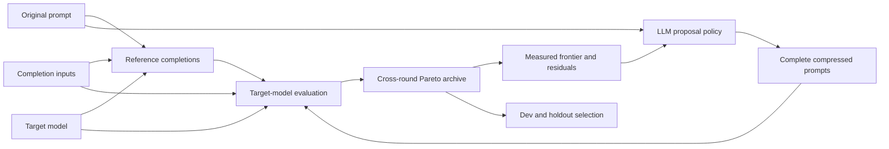

# Lingua Symbolic Prompt Compiler Architecture

Lingua Symbolic Prompt Compiler searches for shorter prompt templates that preserve the behavior of a frozen target model configuration.

```text
input:
  target model M
  original prompt template P
  input examples X

output:
  compressed prompt template P'
  Pareto frontier of candidate reports
  evaluation and trace artifacts
```

Reference outputs are behavioral references:

```text
y_i = M(P, x_i)
```

Candidate outputs are evaluated against those references:

```text
yhat_i = M(P', x_i)
```

The active optimizer uses feedback-conditioned search over complete prompt templates.



## Search state

The original prompt produces the behavioral reference completions used throughout the search.

Every trial stores:

- the complete deployable prompt;
- its actual instruction-token count and savings;
- its parent proposal ids;
- aggregate behavior loss;
- per-example reference and candidate completions.

The archive retains nondominated trials across every round. A trial dominates another when it saves at least as many tokens with no more behavior loss, and is strictly better on one of those objectives.

## Proposal policy

The proposer receives the original prompt plus empirical search feedback:

- diverse frontier parents;
- actual target-tokenizer counts;
- diffs from the original prompt;
- semantic, format, and task metrics;
- poor recent trials;
- worst completion residuals;
- round-by-round frontier improvement.

The proposer returns complete prompts. Candidate eligibility requires a shorter instruction-token count and preservation of the template placeholder sequence.

## Reward and uncertainty

Candidate completions are compared with the original-prompt completions on the same inputs. When labeled expected JSON is present, the primary signal is the change in ground-truth precision, recall, and F1. For unlabeled examples, semantic distance is the primary behavior signal. Format and task-field failures contribute to behavior loss.

Repeated original-prompt completions estimate the target model's natural task or output variation. The estimate supports:

1. natural-distance correction in candidate semantic loss;
2. additional rollouts for close or uncertain frontier candidates.

Additional sampling is concentrated on candidates near the estimated frontier.

## Convergence and selection

Search progress is the normalized hypervolume dominated by the token-savings/behavior-quality frontier. The loop stops after a configured number of rounds without material hypervolume improvement.

Search-frontier prompts are evaluated on dev examples. The dev Pareto frontier is then evaluated on holdout examples. The complete frontier is the primary result, with one prompt recommended using a configurable behavior-loss penalty.

## Components

- `operators/full_prompt_proposer.py`: feedback schema and LLM proposal policy.
- `optimize/search_state.py`: trials, Pareto archive, parent selection, and convergence.
- `optimize/reward.py`: rollout aggregation and uncertainty-based resampling.
- `optimize/feedback_optimizer.py`: end-to-end learning loop.
- `eval/evaluator.py`: target completions and behavior comparisons.
- `reports/writer.py`: reproducible run artifacts.
