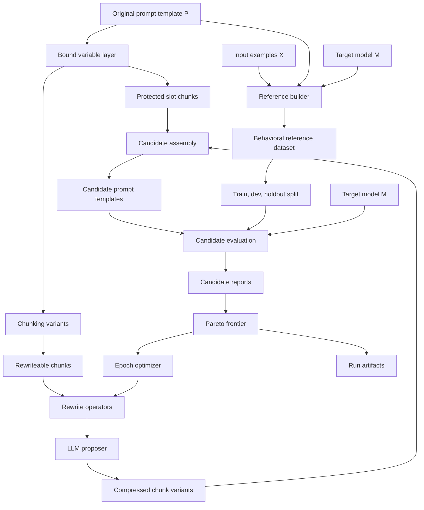

# Behavioral Prompt Compression Architecture

Prompt Compression Layer searches for shorter prompt templates that preserve the behavior of a frozen target model configuration.

```text
input:
  target model M
  original prompt template P
  input examples X

output:
  compressed prompt template P'
  Pareto frontier of candidate reports
  evaluation and trace artifacts
```

Reference outputs are behavioral references:

```text
y_i = M(P, x_i)
```

Candidate outputs are evaluated against those references:

```text
yhat_i = M(P_candidate, x_i)
```

## System Diagram



## Layers

### Bound Variable Layer

Prompt variables are template slots such as `{{input}}`, `{{query}}`, `{{document}}`, and `{{tone}}`.

The bound variable layer extracts those slots as protected input-slot chunks before rewrite exploration. Candidate assembly preserves the original placeholder sequence, so the compressed template remains renderable by the same input contract as the original prompt.

### Chunking Layer

Chunkers produce alternative views of the invariant instruction layer around the bound slots.

Current chunkers:

- paragraph
- sentence
- markdown
- schema-aware
- instruction-role
- token-window

Each chunk carries an id, text, type, character span, token count, and protected flag.

Chunk types:

- role
- task
- constraint
- negative constraint
- output schema
- example
- style
- input slot
- safety
- tool instruction
- unknown

### Exploration Layer

The exploration layer applies rewrite operators to non-bound chunks and assembles candidate prompt templates.

Current operator families:

- keep
- short English
- telegraph English
- symbolic DSL
- schema abbreviation
- hybrid symbolic English
- short Mandarin
- formal Chinese
- classical-Chinese-like
- Mandarin-symbolic
- bilingual DSL
- mixed minimum-token form

For OpenAI-backed exploration, the LLM proposer rewrites one source chunk at a time and returns structured JSON with `rewritten_chunk`, `rationale`, and `risk_notes`.

### Evaluation Layer

Evaluation runs candidate templates through the target model on the current reference subset. The target model is also the model used to build behavioral references, so comparisons measure behavior under the same model role.

The optimization objective is the tradeoff between prompt compression and generated-output equivalence:

- instruction tokens
- token reduction
- Euclidean embedding drift

Optional equivalence scorers can add additional output-distance signals:

- separate LLM judge disagreement
- ROUGE distance
- BLEU distance

Validity and audit signals are tracked separately:

- format failure rate
- task-field failure rate
- failure cases
- candidate output records
- model usage

Embedding drift uses Euclidean distance over generated completions. Mixedbread embeddings are supported through `sentence-transformers` or Hugging Face Inference.

### Optimizer Layer

Each epoch evaluates the current population, computes a Pareto frontier, then generates the next population from frontier candidates.

The current optimizer flow:

```text
seed population
for each epoch:
  evaluate candidates on train subset
  compute Pareto frontier
  mutate frontier candidates into next population
evaluate finalists on dev set
evaluate dev frontier on holdout set
write artifacts
```

The split strategy is deterministic:

```text
train:   first 60 percent
dev:     next 20 percent
holdout: final 20 percent
```

Small datasets reuse available examples for train/dev and leave holdout empty.

## Model Configuration

The target model configuration is part of the behavioral reference definition:

- provider
- model name
- endpoint
- system prompt
- generation parameters
- max output tokens
- tool configuration
- tokenizer specification

The proposer model is a separate configurable role. Its output affects candidate prompt construction, while the target model remains the behavior model used for reference and candidate completions.

## Observability

Each run writes structured JSONL events to:

```text
<output-dir>/run_events.jsonl
```

The CLI also mirrors run events to a stable live log path by default:

```text
runs/live_run_events.jsonl
```

Human-readable progress lines include the phase, candidate id, drift, token reduction, cost estimate when available, and elapsed time.

LLM proposer traces are written to:

```text
<output-dir>/proposer_traces.jsonl
```

These traces include the rendered proposer prompt, proposer response, parsed JSON, rewritten chunk, usage, metadata, and validation status.
