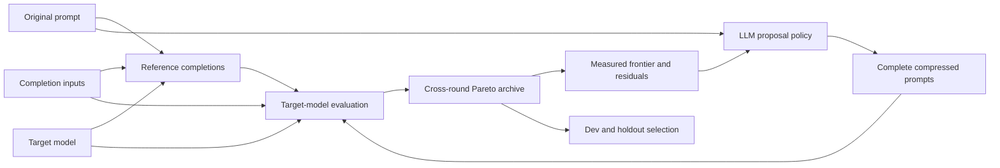

# Architecture

The compiler is a black-box learning loop over complete prompt templates.

## Search state

The original prompt has one role: produce the behavioral reference completions. It is not a candidate or a fallback action.

Every trial stores:

- the complete deployable prompt;
- its actual instruction-token count and savings;
- its parent proposal ids;
- aggregate behavior loss;
- per-example reference and candidate completions.

The archive retains nondominated trials across every round. A trial dominates another when it saves at least as many tokens with no more behavior loss, and is strictly better on one of those objectives.

## Proposal policy

The proposer receives the original prompt plus empirical search feedback:

- diverse frontier parents;
- actual target-tokenizer counts;
- diffs from the original prompt;
- semantic, format, and task metrics;
- poor recent trials;
- worst completion residuals;
- round-by-round frontier improvement.

It returns complete prompts rather than chunk rewrites or edit operations. Local code only verifies that proposals are shorter and preserve the placeholder sequence.

## Reward and uncertainty

Candidate completions are compared with the original-prompt completions on the same inputs. When labeled expected JSON is present, the primary signal is regression in ground-truth precision, recall, and F1. Without labels, semantic distance is the primary behavior signal. Format and task-field failures are soft loss rather than gates.

Repeated original-prompt completions estimate the target model's natural task or output variation. This estimate serves two purposes:

1. remove expected natural distance from candidate semantic loss;
2. identify close or uncertain frontier candidates that deserve another rollout.

Candidates far from the frontier are not repeatedly sampled.

The active OpenAI adapter does not impose a request timeout or output-token ceiling. Experiment budgets such as rounds, proposal batch size, dataset split, and maximum repeat count remain explicit controls because they determine evaluation cost rather than candidate validity.

## Convergence and selection

Search progress is the normalized hypervolume dominated by the token-savings/behavior-quality frontier. The loop stops after a configured number of rounds without material hypervolume improvement.

Search-frontier prompts are evaluated on dev examples. The dev Pareto frontier is then evaluated on holdout examples. The complete frontier is the primary result. For convenience, one prompt is recommended using an explicit, configurable behavior-loss penalty rather than a hidden validation hierarchy.

## Components

- `operators/full_prompt_proposer.py`: feedback schema and LLM proposal policy.
- `optimize/search_state.py`: trials, Pareto archive, parent selection, and convergence.
- `optimize/reward.py`: rollout aggregation and uncertainty-based resampling.
- `optimize/feedback_optimizer.py`: end-to-end learning loop.
- `eval/evaluator.py`: target completions and behavior comparisons.
- `reports/writer.py`: reproducible run artifacts.

The historical chunk/operator path is retained only behind `optimize_prompt_legacy` for ablation. It is not on the CLI or default import path.
